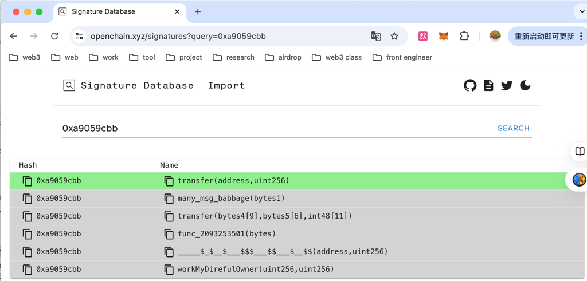
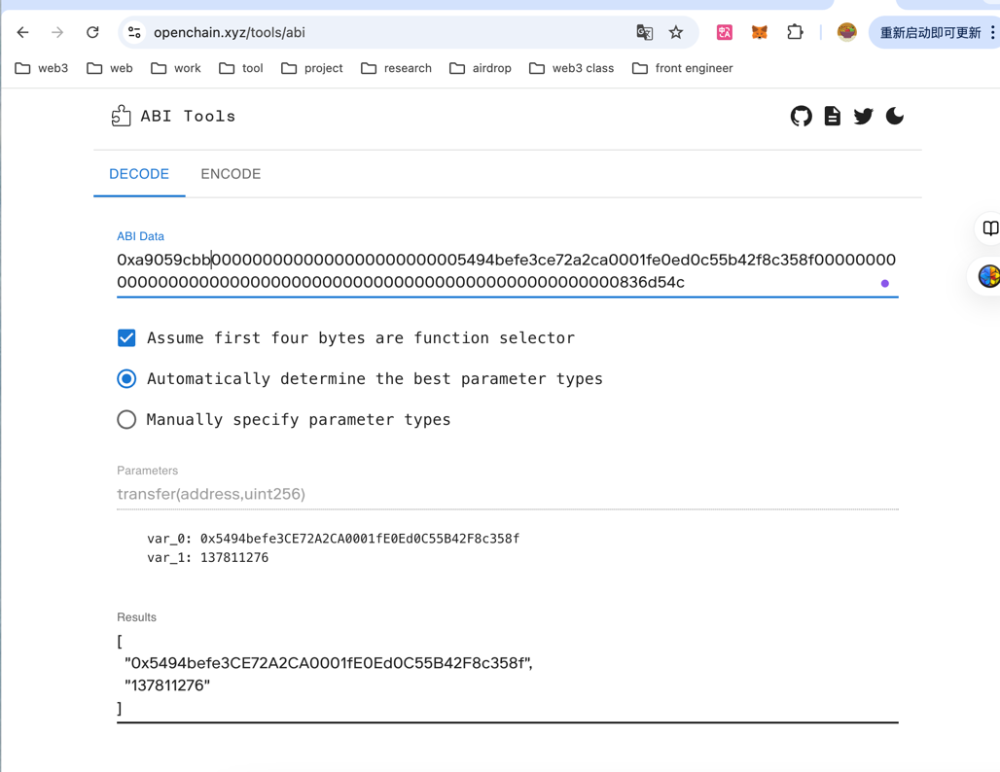

- 1. 获取方法ID：交易数据的前4个字节是方法ID。在你的交易数据中，前4个字节是 0xa9059cbb

```solidity
transfer(address,uint256)
```

- 2. 解析参数
    - 地址参数（从第5个字节开始）：0000000000000000000000005494befe3ce72a2ca0001fe0ed0c55b42f8c358f的前40个字符（20字节）表示目标地址，去掉前面的零，结果是5494befe3ce72a2ca0001fe0ed0c55b42f8c358f
    - 数量参数（从第65个字节开始）：000000000000000000000000000000000000000000000000000000000836d54c，这是一个64个字符（32字节）的十六进制数，表示转账的数量。在十进制中计算为：0x836d54c = 139299052

- 答案
  - https://learnblockchain.cn/article/8761#%E6%8B%9B%E8%81%98%E5%8F%91%E5%B8%83%E6%8E%A5%E5%8F%A3



